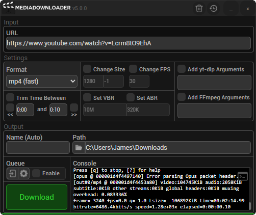

<div align="center">
    <table>
        <tr>
            <td>
                
            </td>
            <td>
                <strong>MediaDownloader</strong>
                <br>
                A simple, <i>lightweight</i> 🍃 GUI wrapper for yt-dlp.
                <br>
                
                
                <br>
                <strong><a href="">Download</a></strong>
            </td>
        </tr>
    </table>
    
</div>

## What is it?

A **simple** and **lightweight** GUI wrapper for [yt-dlp](https://github.com/yt-dlp/yt-dlp) and [FFmpeg](https://ffmpeg.org).

It provides a simple abstraction for basic yt-dlp and FFmpeg features while giving full access to each API via custom argument injections, all nicely packaged in a self-contained, cross-platform binary.

## How do I get it?

By grabbing a binary from the [downloads page](https://github.com/o7q/MediaDownloader/releases).

## How do I build it?

You can follow these steps:
- Ensure you have **Node.js** and **Rust** installed:
  - https://nodejs.org
  - https://www.rust-lang.org

- Download & extract the MediaDownloader [source code](https://github.com/o7q/MediaDownloader/archive/refs/heads/main.zip).
- Navigate into the source code and run following commands:
    ```
    npm install
    ```
    ```
    npm run tauri-build
    ```

The built binary can be found in `src/app/target/release`

---

Built with [**Tauri**](https://tauri.app)
