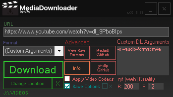

# MediaDownloader
A tool that uses yt-dlp and ffmpeg to download video and audio from virtually any website.

Welcome! MediaDownloader is a simple, GUI-based tool that removes the hassle of using yt-dlp through a command-line.

### OVERVIEW
URL: Specify URL of website for MediaDownloader to downloader

Format: Specify format for downloaded media to be converted to

Download: Download the URL with the specified arguments

Change Location: Change the location the media file is downloaded to

Viewer Raw Formats: Displays all media types found on the specified URL's web server

MediaD GitHub: Opens the MediaDownloader GitHub page

yt-dlp GitHub: Opens the yt-dlp GitHub page (you can use this to find arguments used in the "Custom DL Arguments" section

Info: Shows info about MediaDownloader

Apply Video Codecs: Applies codecs to downloaded media files (this can fix issues when importing into some video editors. warning: this option can be very slow)

Save Options: Saves all options to config files stored in the "mediadownloader" directory

Custom DL Arguments: Specify custom arguments that yt-dlp will accept

gif (web) Quality: R = Resolution & F = Framerate (this is helpful for uploading gifs to something such as Discord if you do not have Discord Nitro)

MediaDownloader: https://github.com/o7q/MediaDownloader

yt-dlp: https://github.com/yt-dlp/yt-dlp

ffmpeg: https://ffmpeg.org

Running C# .NET Framework 4.8.
If you want to compile the code yourself I highly recommend using Visual Studio.