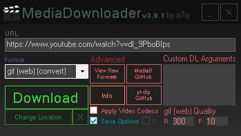

# MediaDownloader
A tool that uses yt-dlp and ffmpeg to download video and audio from virtually any website.

Welcome! MediaDownloader is a simple, GUI-based tool that removes the hassle of using yt-dlp through a command-line.

MediaDownloader: https://github.com/o7q/MediaDownloader
yt-dlp: https://github.com/yt-dlp/yt-dlp
ffmpeg: https://ffmpeg.org

Running C# .NET Framework 4.8.
If you want to compile the code yourself I highly recommend using Visual Studio.