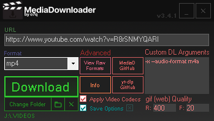

# Downloads: https://github.com/o7q/MediaDownloader/releases
### Welcome! MediaDownloader is a simple, lightning-fast, GUI-based tool that removes the hassle of using yt-dlp through a command-line.

 

 

# Overview
Powered by: \
yt-dlp: https://github.com/yt-dlp/yt-dlp \
ffmpeg: https://ffmpeg.org

MediaDownloader takes in arguments and auto-configures a batch script for yt-dlp.\
FFmpeg is then used for farther media processing if specified to do so.

## <b>Components</b>
<b>URL Input</b> Specify the URL of website for MediaDownloader to download \
<b>Format Dropdown</b> Specify the format for downloaded media to be converted to \
<b>Download Button</b> Downloads the URL with the specified arguments \
<b>Change Path Button</b> Change the location the media file is downloaded to \
<b>Open Path Button</b> Opens the selected download location in Windows Explorer \
<b>Clear Path Button</b> Clears the selected path \
<b>View Raw Formats Button</b> Displays all media types found on the specified URL's web server \
<b>MediaD GitHub Button</b> Opens this MediaDownloader GitHub page \
<b>yt-dlp GitHub Button</b> Opens the `yt-dlp` GitHub page (you can use this to find arguments used in the `Custom DL Arguments` section \
<b>Info Button</b> Shows info about MediaDownloader \
<b>Apply Video Codecs Checkbox</b> Applies codecs to downloaded media files (this can fix issues when importing into some video editors. warning: this option can be very slow depending on your hardware) \
<b>Save Options Checkbox</b> Saves all options to config files stored in the `mediadownloader` directory \
<b>Custom DL Arguments Input</b> Specify custom arguments that `yt-dlp` will accept \
<b>gif (web) Quality Inputs</b> `R = X Resolution` (will preserve aspect ratio) & `F = Framerate` (this is helpful for uploading gifs to something such as Discord if you do not have Discord Nitro)

 

<i>Programmed with C# and .NET Framework 4.8.</i> \
<i>If you want to compile the code yourself I highly recommend using Visual Studio.</i>