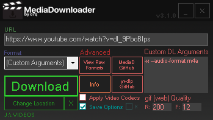

#### https://github.com/o7q/MediaDownloader
#### Welcome! MediaDownloader is a simple, GUI-based tool that removes the hassle of using yt-dlp through a command-line.
 

# Overview
Powered by: \
yt-dlp: https://github.com/yt-dlp/yt-dlp \
ffmpeg: https://ffmpeg.org \
 

## <b>Components</b>
<b>URL:</b> Specify URL of website for MediaDownloader to downloader \
<b>Format:</b> Specify format for downloaded media to be converted to \
<b>Download:</b> Downloads the URL with the specified arguments \
<b>Change Location:</b> Change the location the media file is downloaded to \
<b>View Raw Formats:</b> Displays all media types found on the specified URL's web server \
<b>MediaD GitHub:</b> Opens the MediaDownloader GitHub page \
<b>yt-dlp GitHub:</b> Opens the yt-dlp GitHub page (you can use this to find arguments used in the "Custom DL Arguments" section \
<b>Info:</b> Shows info about MediaDownloader \
<b>Apply Video Codecs:</b> Applies codecs to downloaded media files (this can fix issues when importing into some video editors. warning: this option can be very slow) \
<b>Save Options:</b> Saves all options to config files stored in the "mediadownloader" directory \
<b>Custom DL Arguments:</b> Specify custom arguments that yt-dlp will accept \
<b>gif (web) Quality:</b> R = X Resolution (will preserve aspect ratio) & F = Framerate (this is helpful for uploading gifs to something such as Discord if you do not have Discord Nitro) \
 

 \
 

Running C# .NET Framework 4.8. \
If you want to compile the code yourself I highly recommend using Visual Studio.